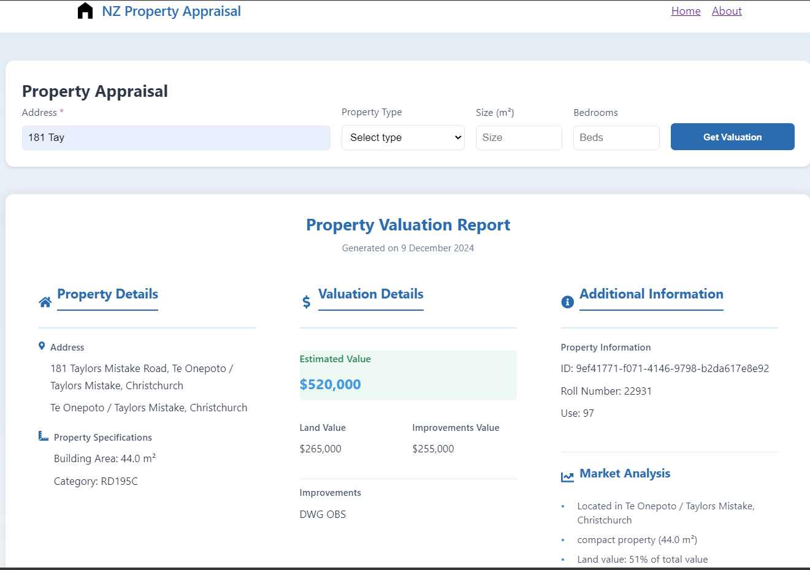
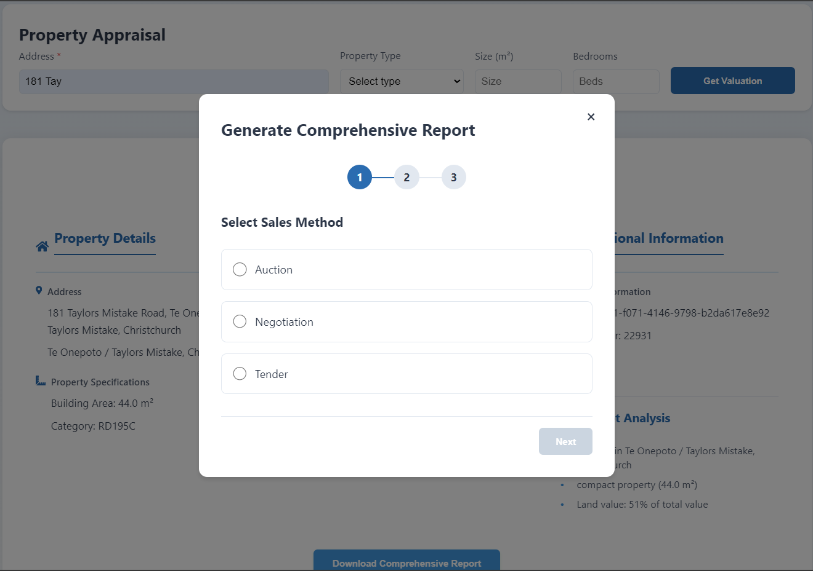
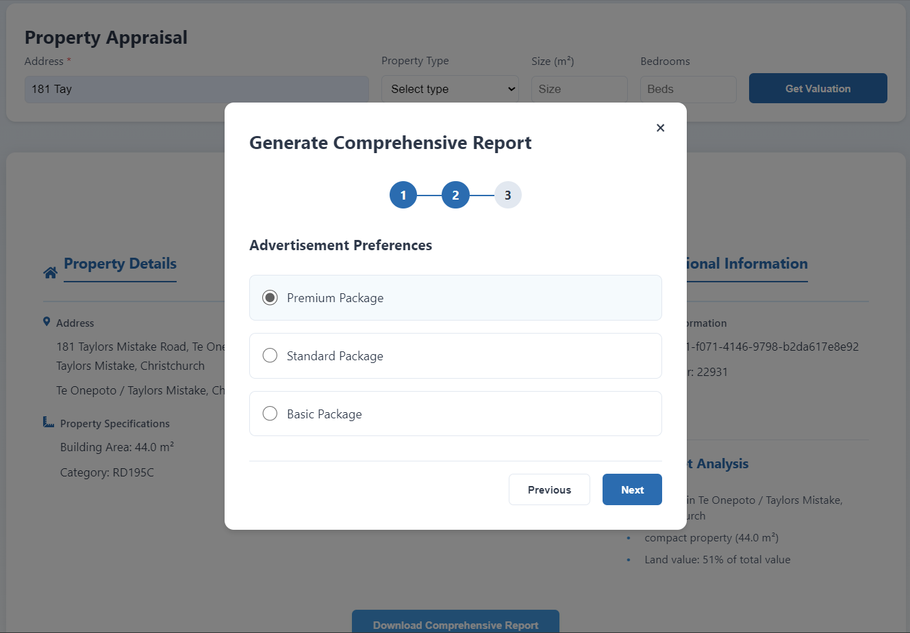
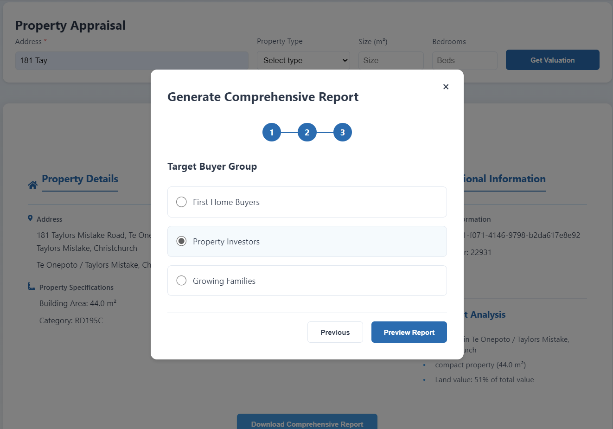
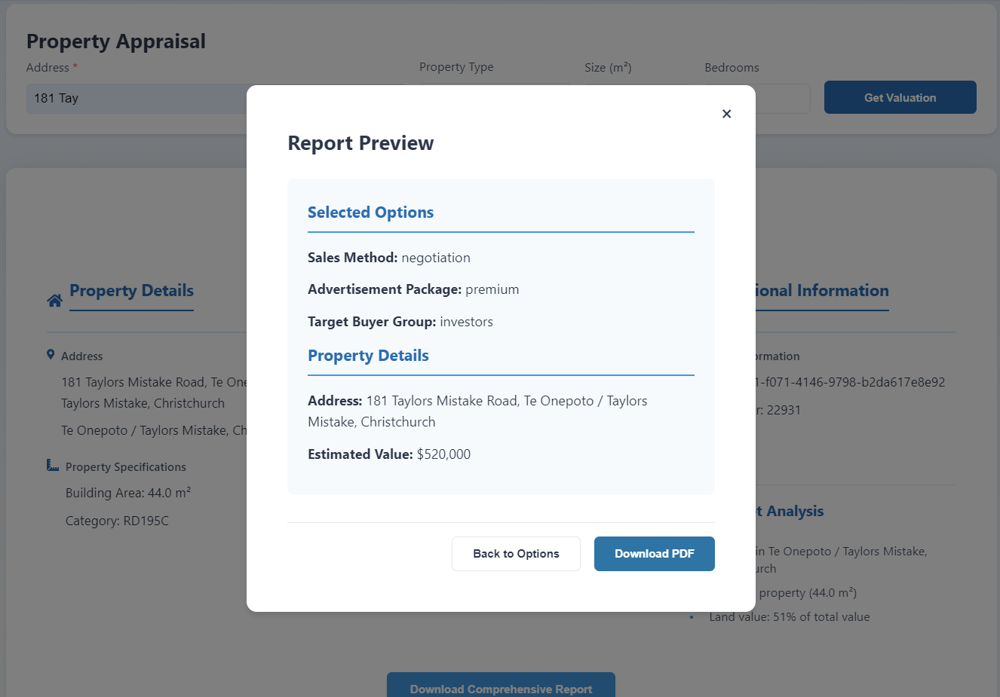
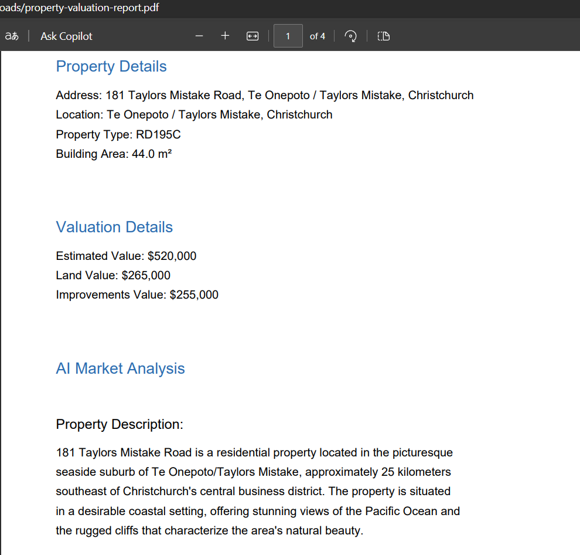

# Property Appraisal Analysis System

A comprehensive web application for analyzing New Zealand property valuations, featuring data processing, analysis, and visualization capabilities.

## Project Overview

This project provides a full-stack solution for processing and analyzing New Zealand's national district valuation roll data. It combines powerful backend processing with an interactive frontend interface to make property valuation data more accessible and insightful.

## Project Structure

```
property_appraisal/
├── back-end/               # FastAPI backend server
│   ├── llm/               # Language model integration
│   ├── main.py            # Main application entry
│   ├── database.py        # Database configuration
│   ├── models.py          # Database models
│   └── schemas.py         # Pydantic schemas
├── front-end/             # React TypeScript frontend
│   ├── src/              # Source code
│   └── public/           # Public assets
└── data_process/         # Data processing scripts and raw data
    └── nz-properties-national-district-valuation-roll.csv
```

## Technologies Used

### Backend
- FastAPI (v0.109.2)
- SQLAlchemy (v2.0.27)
- PostgreSQL
- Python 3.x
- LangChain + Anthropic for AI-powered analysis

### Frontend
- React 18
- TypeScript
- React Router DOM
- Modern UI components
- PDF Generation (jsPDF)

## Setup and Installation

### Backend Setup
1. Navigate to the backend directory:
   ```bash
   cd back-end
   ```

2. Create and activate a virtual environment:
   ```bash
   python -m venv venv
   source venv/bin/activate  # On Windows: venv\Scripts\activate
   ```

3. Install dependencies:
   ```bash
   pip install -r requirements.txt
   ```

4. Set up environment variables:
   - Copy `.env.example` to `.env`
   - Configure your database and API credentials

### Frontend Setup
1. Navigate to the frontend directory:
   ```bash
   cd front-end
   ```

2. Install dependencies:
   ```bash
   npm install
   ```

3. Start the development server:
   ```bash
   npm start
   ```

## Features

- Property data processing and analysis
- Interactive data visualization
- AI-powered property insights
- PDF report generation
- Responsive web interface
- Secure database integration

## Screenshots and Features

### 1. Homepage

The main dashboard provides a comprehensive view of property valuations across New Zealand.

### 2. Generate comprehensive reports

Advanced search functionality allows users to find specific properties using various filters.

### 3. Sale Methods Selection

Interactive charts and graphs help visualize property trends and patterns.

### 4. Preview Report

AI-powered insights provide deeper understanding of property valuations and market trends.

### 5. Report Generation

Generate detailed PDF reports with property analysis and comparisons.

### 6. Downloaded Property PDF

In-depth view of individual property details and valuation history.

## Generated Reports

The system can generate comprehensive property valuation reports (`property-valuation-report.pdf`) that include:
- Detailed property analysis
- Comparative market analysis
- Historical valuation trends
- AI-generated insights
- Location-based analytics

## Data Processing

The system processes the New Zealand national district valuation roll data, which includes:
- Property valuations
- Location data
- Property characteristics
- Historical valuation trends

## Contributing

1. Fork the repository
2. Create your feature branch (`git checkout -b feature/AmazingFeature`)
3. Commit your changes (`git commit -m 'Add some AmazingFeature'`)
4. Push to the branch (`git push origin feature/AmazingFeature`)
5. Open a Pull Request

## License

This project is proprietary and confidential. Unauthorized copying or distribution of this project's files, via any medium, is strictly prohibited.

## Contact

For any queries regarding this project, please reach out to the project maintainers.
